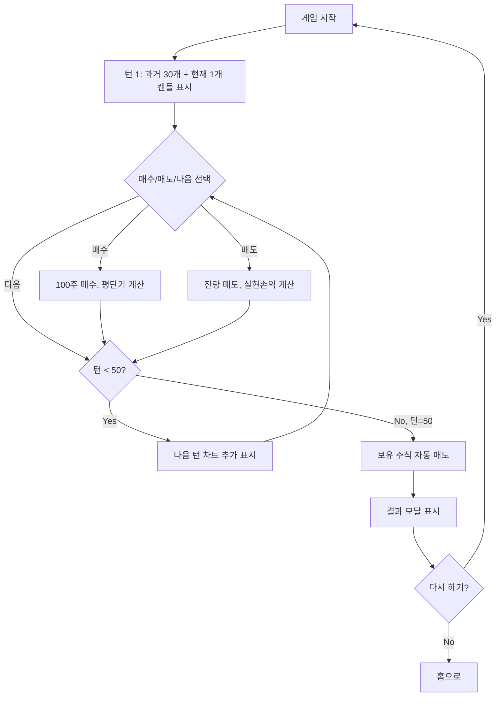

# 차트 매매 게임 명세서 (v2.0)

## 1. 프로젝트 개요

실제 주식/코인 트레이딩과 유사한 환경에서 차트 분석 능력을 훈련할 수 있는 시뮬레이션 게임입니다.

### 핵심 정보
- **총 턴수**: 50턴
- **초기 자산**: 10,000,000원
- **거래 단위**: 100주
- **게임 목표**: 차트 분석을 통한 최대 수익률 달성

### 기술 스택
- **프레임워크**: Next.js 15 (App Router)
- **언어**: TypeScript (strict mode)
- **상태 관리**: Jotai
- **스타일링**: Tailwind CSS
- **아키텍처**: FSD (Feature-Sliced Design)

---

## 2. 게임 플로우



---

## 3. 고급 차트 분석 기능 ⭐

### 3.1 캔들스틱 차트
- **데이터**: 80개 캔들 (과거 30개 + 게임 50개)
- **표시**: 시가/고가/저가/종가
- **색상**: 상승(초록), 하락(빨강)
- **범위**: 10,000 ~ 15,000원

### 3.2 이동평균선 (MA)
```typescript
MA5 (노란색)  // 5일 이동평균 - 단기 추세
MA20 (보라색) // 20일 이동평균 - 중기 추세

// 매매 신호
골든크로스: MA5 ↗ MA20 → 매수 신호
데드크로스: MA5 ↘ MA20 → 매도 신호
```

### 3.3 거래량 (Volume)
- 차트 중간에 막대 그래프
- 상승 캔들: 연두색 반투명
- 하락 캔들: 빨간색 반투명
- 거래량 많음 = 신호 신뢰도 ↑

### 3.4 RSI 지표 (14일)
```
RSI > 70  → 과매수 (매도 고려)
RSI < 30  → 과매도 (매수 고려)
RSI ≈ 50  → 중립
```

### 3.5 마우스 호버 툴팁
마우스를 캔들에 올리면 상세 정보 표시:
- 턴 번호
- 시가/고가/저가/종가
- 거래량
- MA5, MA20 값
- RSI 값 (색상으로 과매수/과매도 표시)

---

## 4. 데이터 모델

### 4.1 타입 정의

```typescript
// 캔들 데이터
type Candle = {
  open: number;    // 시가
  high: number;    // 고가
  low: number;     // 저가
  close: number;   // 종가
  volume: number;  // 거래량
};

// 거래 이력
type Trade = {
  turn: number;          // 거래 턴
  type: 'buy' | 'sell';  // 매수/매도
  price: number;         // 체결가
  shares: number;        // 주식 수
  amount: number;        // 거래 금액
};

// 게임 상수
const GAME_CONSTANTS = {
  INITIAL_CASH: 10_000_000,  // 초기 자산
  MAX_TURNS: 50,             // 최대 턴
  SHARES_PER_TRADE: 100,     // 거래 단위
  PAST_CANDLES: 30,          // 과거 차트 개수
};
```

### 4.2 차트 데이터 구조

```typescript
// candleData.ts: 총 80개 캔들
[
  // 인덱스 0~29: 게임 시작 전 과거 차트 (30개)
  // - 사용자가 추세를 분석할 수 있도록
  // - 이동평균선/RSI 계산에 필요

  // 인덱스 30~79: 게임 턴 데이터 (50개)
  // - 턴 1 = 인덱스 30
  // - 턴 50 = 인덱스 79
]

// 현재가 계산
currentPrice = candleData[PAST_CANDLES + currentTurn - 1].close
```

---

## 5. 폴더 구조 (FSD + Next.js App Router)

```
chart-game/
├── src/
│   ├── app/                      # Next.js App Router (라우팅)
│   │   ├── layout.tsx           # 루트 레이아웃
│   │   ├── page.tsx             # 홈 페이지
│   │   ├── game/
│   │   │   └── page.tsx         # 게임 페이지
│   │   └── globals.css          # 글로벌 스타일 + 애니메이션
│   │
│   ├── widgets/                  # 페이지 수준 UI 블록
│   │   ├── game-board/
│   │   │   ├── ui/
│   │   │   │   └── GameBoard.tsx        # 게임 화면 전체
│   │   │   └── index.ts
│   │   └── result-screen/
│   │       ├── ui/
│   │       │   └── ResultScreen.tsx     # 결과 모달
│   │       └── index.ts
│   │
│   ├── features/                 # 비즈니스 기능
│   │   ├── chart/
│   │   │   ├── ui/
│   │   │   │   └── ChartCanvas.tsx      # 고급 차트 (MA/Volume/RSI)
│   │   │   └── index.ts
│   │   └── trading/
│   │       ├── ui/
│   │       │   ├── StatusInfo.tsx       # 자산/손익 정보
│   │       │   └── ActionButtons.tsx    # 매수/매도/다음 버튼
│   │       └── index.ts
│   │
│   └── shared/                   # 공통 코드
│       ├── atoms/
│       │   └── gameAtom.ts              # Jotai 상태 관리
│       ├── hooks/
│       │   └── useGameStore.ts          # 게임 스토어 훅
│       ├── types/
│       │   └── gameTypes.ts             # 타입 정의
│       ├── data/
│       │   └── candleData.ts            # 80개 캔들 데이터
│       ├── utils/
│       │   └── indicators.ts            # MA/RSI/볼린저밴드 계산
│       └── ui/
│           ├── Modal.tsx                # 모달 컴포넌트
│           └── index.ts
│
├── docs/
│   └── SPEC.md                   # 이 문서
├── public/
├── package.json
├── tsconfig.json
└── next.config.ts
```

---

## 6. UI/UX 레이아웃

### 6.1 게임 화면 (2컬럼 레이아웃)

```
데스크톱 (≥1024px):
┌─────────────────────────────────────────────┐
│  턴: 15/50          현재가: 13,450원        │ ← 헤더
├────────────────────────────┬────────────────┤
│                            │ 💰 현금         │
│                            │ 📈 보유 주식    │
│        📊 차트 분석         │ 📊 평가손익     │
│     (800x550px)            │ 💵 실현손익     │
│  - MA5/MA20                │ 🎯 총 자산      │
│  - 거래량                  ├────────────────┤
│  - RSI                     │ 💰 매수         │
│  - 호버 툴팁               │ 💵 매도         │
│                            │ ▶️ 다음         │
└────────────────────────────┴────────────────┘

모바일 (< 1024px):
┌──────────────┐
│    헤더      │
├──────────────┤
│    차트      │
├──────────────┤
│  상태 정보   │
├──────────────┤
│  액션 버튼   │
└──────────────┘
```

### 6.2 차트 영역 상세

```
┌──────────────────────────────────┐
│ MA5 ━━  MA20 ━━                  │ ← 범례
├──────────────────────────────────┤
│         │                        │
│  12,000 ├────╔══╗────            │
│         │    ║  ║                │ ← 가격 차트
│  11,000 ├────╚══╝────            │   (캔들스틱 + MA)
│         │                        │
├──────────────────────────────────┤
│ Volume                           │
│  ██ █ ██ █                       │ ← 거래량
├──────────────────────────────────┤
│ RSI (14)                         │
│  70 ----  [과매수]               │
│  50 ----  ━━━━━                  │ ← RSI 지표
│  30 ----  [과매도]               │
└──────────────────────────────────┘
```

### 6.3 상태 정보 (오른쪽 패널)

```
╔════════════════════════════╗
║ 💰 현금: 9,500,000원        ║
║ 📈 보유: 100주 @ 12,300원   ║
║    평단가: 12,300원         ║
║ 📊 평가손익: +115,000원     ║
║            (+0.93%)         ║
║ 💵 실현손익: -250,000원     ║
║───────────────────────────║
║ 🎯 총 자산: 10,365,000원    ║
║    수익률: +3.65%          ║
╚════════════════════════════╝
```

### 6.4 액션 버튼 (세로 배치)

```
╔════════════════════════════╗
║ [  💰 매수               ] ║
║    100주 / 1,250,000원     ║
║                            ║
║ [  💵 매도               ] ║
║    전량 매도               ║
║                            ║
║ [  ▶️ 다음               ] ║
║    다음 턴                 ║
╚════════════════════════════╝
```

---

## 7. 게임 로직 상세

### 7.1 매수 로직

```typescript
function buyShares() {
  const cost = currentPrice * 100;

  // 1. 자금 검증
  if (cash < cost) {
    return; // 버튼 비활성화됨
  }

  // 2. 평단가 계산
  const totalShares = shares + 100;
  const totalCost = (shares * entryPrice) + cost;
  const newEntryPrice = totalCost / totalShares;

  // 3. 상태 업데이트
  cash -= cost;
  shares = totalShares;
  entryPrice = newEntryPrice;

  // 4. 거래 기록
  trades.push({
    turn: currentTurn,
    type: 'buy',
    price: currentPrice,
    shares: 100,
    amount: cost
  });
}
```

### 7.2 매도 로직

```typescript
function sellShares() {
  if (shares === 0) return;

  const revenue = currentPrice * shares;
  const profit = (currentPrice - entryPrice) * shares;

  // 상태 업데이트
  cash += revenue;
  realizedProfit += profit;

  // 거래 기록
  trades.push({
    turn: currentTurn,
    type: 'sell',
    price: currentPrice,
    shares: shares,
    amount: revenue
  });

  shares = 0;
  entryPrice = 0;
}
```

### 7.3 턴 진행 로직

```typescript
function nextTurn() {
  // 턴 50: 자동 매도 후 게임 종료
  if (currentTurn === 50) {
    if (shares > 0) {
      sellShares();
    }
    currentTurn = 51; // isGameOver = true
    // → 결과 모달 표시
    return;
  }

  // 일반 턴: 다음 턴으로
  currentTurn++;
}
```

### 7.4 손익 계산

```typescript
// 평가손익 (보유 중)
unrealizedProfit = (currentPrice - entryPrice) * shares;
unrealizedProfitRate = (currentPrice - entryPrice) / entryPrice * 100;

// 총 자산
totalAssets = cash + (currentPrice * shares);

// 수익률
profitRate = (totalAssets - INITIAL_CASH) / INITIAL_CASH * 100;
```

---

## 8. 결과 화면 (모달)

### 8.1 모달 디자인

```
┌────────────────────────────────┐
│  ╔═══════════════════════════╗ │
│  ║      🎮 게임 종료!         ║ │ ← 그라디언트 헤더
│  ║   50턴이 모두 끝났습니다   ║ │   (파란→보라)
│  ╚═══════════════════════════╝ │
│  ┌───────────────────────────┐ │
│  │ 💰 초기 자산: 10,000,000원 │ │
│  │ 💎 최종 자산: 11,250,000원 │ │
│  │ 💵 수익: +1,250,000원      │ │
│  │                           │ │
│  │ 📈 수익률: +12.5%         │ │ ← 초대형
│  └───────────────────────────┘ │
│  ┌───────────────────────────┐ │
│  │ 📊 거래 이력               │ │
│  │ ─────────────────────────│ │
│  │ 턴 5:  [매수] 100주        │ │
│  │ 턴 15: [매도] 100주        │ │
│  │ ... (스크롤)              │ │
│  └───────────────────────────┘ │
│  [ 🔄 다시 하기 ] [ 🏠 홈으로 ] │
└────────────────────────────────┘
```

### 8.2 모달 애니메이션

```css
/* 배경 페이드인 (0.2초) */
@keyframes fadeIn {
  from { opacity: 0; }
  to { opacity: 1; }
}

/* 모달 스케일인 (0.3초) */
@keyframes scaleIn {
  from {
    opacity: 0;
    transform: scale(0.9);
  }
  to {
    opacity: 1;
    transform: scale(1);
  }
}
```

### 8.3 반응형 모달

```
모바일: max-w-3xl (768px)
높이: max-h-90vh (스크롤 가능)
패딩: p-4 (16px)
```

---

## 9. 상태 관리 (Jotai)

### 9.1 Atom 구조

```typescript
// 기본 상태
baseGameStateAtom = {
  currentTurn: 1,
  cash: 10_000_000,
  shares: 0,
  entryPrice: 0,
  realizedProfit: 0,
  trades: []
}

// 읽기 전용 Computed Atoms
currentPriceAtom          // 현재가
positionValueAtom         // 보유 주식 평가액
unrealizedProfitAtom      // 평가손익
totalAssetsAtom           // 총 자산
profitRateAtom            // 수익률
canBuyAtom                // 매수 가능 여부
canSellAtom               // 매도 가능 여부
visibleCandleDataAtom     // 현재 턴까지 표시할 캔들

// 액션 Atoms
buySharesAtom             // 매수
sellSharesAtom            // 매도
nextTurnAtom              // 다음 턴
resetGameAtom             // 게임 리셋
```

### 9.2 커스텀 훅

```typescript
// useGameStore.ts
export const useGameStore = () => {
  // 모든 상태와 액션을 통합 제공
  return {
    // 상태
    currentTurn, maxTurns, cash, shares, entryPrice,
    currentPrice, totalAssets, profitRate,
    unrealizedProfit, unrealizedProfitRate,
    realizedProfit, trades,

    // 플래그
    canBuy, canSell, isGameOver, isLastTurn,

    // 차트 데이터
    visibleCandleData,

    // 액션
    buyShares, sellShares, nextTurn, resetGame
  };
};
```

---

## 10. 보조 지표 계산 로직

### 10.1 이동평균선 (MA)

```typescript
function calculateMA(candles: Candle[], period: number) {
  const ma: (number | null)[] = [];

  for (let i = 0; i < candles.length; i++) {
    if (i < period - 1) {
      ma.push(null); // 데이터 부족
      continue;
    }

    let sum = 0;
    for (let j = 0; j < period; j++) {
      sum += candles[i - j].close;
    }
    ma.push(sum / period);
  }

  return ma;
}
```

### 10.2 RSI (14일)

```typescript
function calculateRSI(candles: Candle[], period = 14) {
  const rsi: (number | null)[] = [];

  // 가격 변화 계산
  const changes = [];
  for (let i = 1; i < candles.length; i++) {
    changes.push(candles[i].close - candles[i-1].close);
  }

  // RSI 계산
  for (let i = 0; i < candles.length; i++) {
    if (i < period) {
      rsi.push(null);
      continue;
    }

    let gains = 0, losses = 0;
    for (let j = 0; j < period; j++) {
      const change = changes[i - period + j];
      if (change > 0) gains += change;
      else losses += Math.abs(change);
    }

    const avgGain = gains / period;
    const avgLoss = losses / period;
    const rs = avgGain / avgLoss;

    rsi.push(100 - (100 / (1 + rs)));
  }

  return rsi;
}
```

---

## 11. 반응형 디자인

### 11.1 브레이크포인트

```css
/* Tailwind 기본 */
sm:  640px  /* 스마트폰 가로 */
md:  768px  /* 태블릿 */
lg:  1024px /* 데스크톱 */
xl:  1280px /* 와이드 */
```

### 11.2 레이아웃 변화

```typescript
// 게임 화면
< 1024px: grid-cols-1      // 세로 배치
≥ 1024px: grid-cols-[1fr_400px]  // 차트 | 사이드바

// 헤더
< 640px: flex-col          // 세로
≥ 640px: flex-row          // 가로

// 차트 크기
모바일: 가로 스크롤 가능
데스크톱: 800x550px
```

---

## 12. 엣지 케이스 & 에러 처리

| 상황 | 처리 방법 |
|------|-----------|
| 자금 부족 | 매수 버튼 비활성화 + "자금 부족" 툴팁 |
| 보유 주식 없음 | 매도 버튼 비활성화 + "보유 주식 없음" 툴팁 |
| 턴 50에서 매수 | 허용 (자동 매도됨) |
| 거래 없이 게임 종료 | 초기 자산 그대로 (수익률 0%) |
| 모달 외부 클릭 | 닫히지 않음 (closeOnBackdrop=false) |

---

## 13. 개발 완료 체크리스트

### ✅ Phase 1: 프로젝트 초기화
- [x] Next.js 15 + TypeScript 설정
- [x] Tailwind CSS 설정
- [x] Jotai 설치
- [x] FSD 폴더 구조 생성
- [x] 절대 경로 설정 (`@/*`)

### ✅ Phase 2: 데이터 & 타입
- [x] `gameTypes.ts` - 타입 정의 및 상수
- [x] `candleData.ts` - 80개 캔들 데이터 (과거 30 + 게임 50)
- [x] `indicators.ts` - MA/RSI 계산 함수

### ✅ Phase 3: 상태 관리
- [x] `gameAtom.ts` - Jotai atoms (상태 + 액션)
- [x] `useGameStore.ts` - 커스텀 훅

### ✅ Phase 4: UI 컴포넌트
- [x] `ChartCanvas.tsx` - 고급 차트 (MA/Volume/RSI/툴팁)
- [x] `StatusInfo.tsx` - 자산/손익 정보
- [x] `ActionButtons.tsx` - 매수/매도/다음 (세로 배치)
- [x] `Modal.tsx` - 모달 컴포넌트

### ✅ Phase 5: 위젯
- [x] `GameBoard.tsx` - 2컬럼 레이아웃
- [x] `ResultScreen.tsx` - 결과 모달

### ✅ Phase 6: 페이지
- [x] `app/page.tsx` - 홈 화면
- [x] `app/game/page.tsx` - 게임 화면
- [x] `app/layout.tsx` - 루트 레이아웃

### ✅ Phase 7: 마무리
- [x] 반응형 디자인 (모바일/데스크톱)
- [x] 모달 애니메이션
- [x] 턴 50 자동 매도 로직
- [x] 과거 차트 데이터 표시

---

## 14. 향후 개선 가능 항목 (추후)

### 기능 추가
- [ ] 여러 난이도 (쉬움/보통/어려움)
- [ ] 리더보드 (수익률 순위)
- [ ] 실제 주식 데이터 가져오기 (API 연동)
- [ ] 볼린저 밴드 표시 옵션
- [ ] MACD 지표 추가
- [ ] 분봉/일봉 전환
- [ ] 여러 차트 시나리오 (랜덤 선택)

### UX 개선
- [ ] 사운드 효과 (매수/매도/게임 종료)
- [ ] 성과 배지 시스템
- [ ] 튜토리얼 모드
- [ ] 차트 패턴 힌트 시스템

### 기술 개선
- [ ] 차트 성능 최적화 (WebGL)
- [ ] PWA 적용 (오프라인 플레이)
- [ ] 다크/라이트 모드 토글
- [ ] 다국어 지원

---

## 15. 참고 자료

### 프로젝트 구조
- [FSD 공식 문서](https://feature-sliced.design/)
- [Next.js App Router](https://nextjs.org/docs/app)

### 기술 분석
- [이동평균선 전략](https://www.investopedia.com/terms/m/movingaverage.asp)
- [RSI 지표](https://www.investopedia.com/terms/r/rsi.asp)
- [캔들스틱 차트](https://www.investopedia.com/trading/candlestick-charting-what-is-it/)

---

**마지막 업데이트**: 2025-11-04
**버전**: 2.0 (고급 차트 기능 및 반응형 레이아웃 완성)
